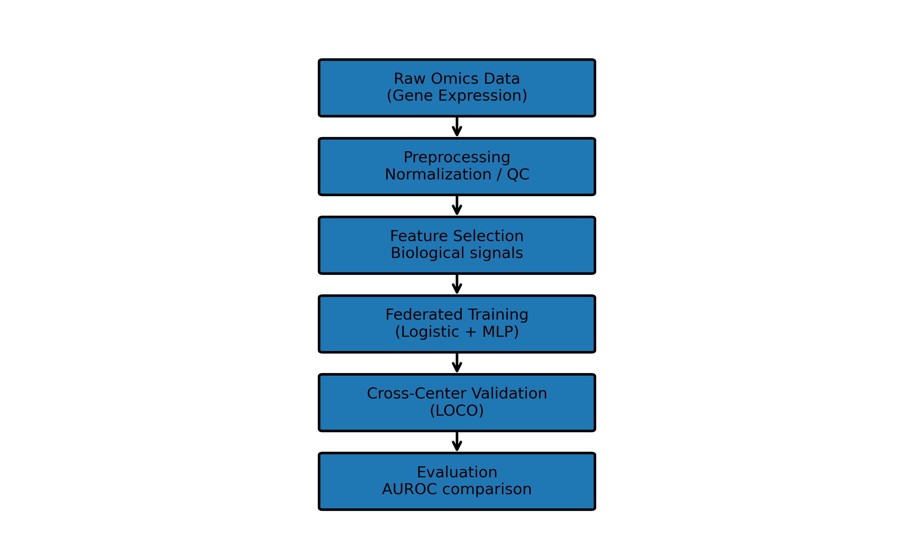
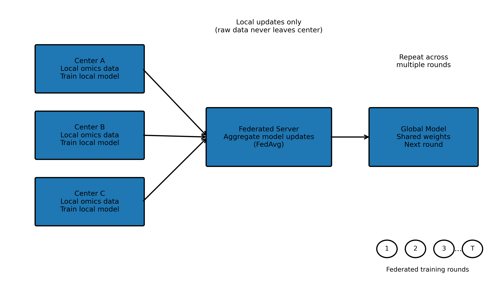

# FedOmics
### Federated Learning for Multi-Center Omics Modeling

FedOmics is a reproducible research framework for training machine‑learning models on **distributed biomedical omics datasets** (gene expression, methylation, proteomics) using **federated learning**.

The project demonstrates how multiple institutions can collaboratively train predictive models **without sharing raw patient data**, while exploring an important scientific question:

> **When does deep learning provide a meaningful advantage over classical linear models in biological datasets?**

FedOmics answers this question through controlled simulation experiments and a real-data example using **TCGA prostate cancer (PRAD) gene expression data**.

---

# Results Snapshot

FedOmics evaluates federated learning across simulated and real omics datasets.

### Simulation Experiments

| Signal Type | Logistic Regression AUROC | Federated Neural Network AUROC |
|-------------|--------------------------|--------------------------------|
| Linear | 0.949 | 0.957 |
| Interaction | 0.658 | 0.731 |
| Mixed | 0.688 | 0.787 |

### Real Dataset (TCGA PRAD)

| Dataset | Logistic AUROC | Federated PyTorch AUROC |
|--------|---------------|-------------------------|
| TCGA PRAD | 0.805 | 0.850 |
| TCGA PRAD + simulation augmentation to training data | 0.8297 | 0.8529 |

### Cross-Center Generalization (LOCO)

| Model | Mean AUROC |
|------|------------|
| Federated PyTorch | 0.802 |
| Logistic Regression | 0.791 |

These results highlight demonstrate that:

> **Deep learning provides the largest gains when biological signal structure contains nonlinear interactions.**

---

# Scientific Motivation

Large biomedical datasets are often distributed across hospitals or research institutes. Privacy regulations frequently prevent sharing raw genomic data across institutions.

Federated learning allows institutions to:

1. Train models **locally on their own datasets**
2. Share **model parameters instead of data**
3. Combine updates centrally using **Federated Averaging (FedAvg)**

This enables collaborative model training while preserving **patient privacy and institutional control**.

---

# Experimental Design

FedOmics investigates two core research questions.

### Research Question 1
**Can federated learning train predictive omics models across institutions without sharing patient data?**

To test this, multiple institutions train models locally and share only model updates with a central aggregator using FedAvg.

Evaluation metrics include:

- AUROC
- Accuracy
- F1 score
- Leave‑One‑Center‑Out validation (LOCO)

### Research Question 2
**When does deep learning outperform classical linear models for biological datasets in a feerated setting?**

Biological phenotypes may arise from:

- additive gene effects
- gene‑gene interactions
- nonlinear pathway activation

To study this, FedOmics generates datasets with controlled signal structure.

| Signal Mode | Hypothesis |
|--------------|------------|
| Linear | Logistic regression performs competitively |
| Interaction | Neural networks capture nonlinear structure |
| Mixed | Deep learning provides modest but consistent gains |

---

# Pipeline Overview



Workflow:

1. Load raw omics datasets
2. Preprocess expression matrices
3. Perform feature selection
4. Train federated models across simulated centers
5. Aggregate weights using FedAvg
6. Evaluate performance using AUROC
7. Perform cross‑center validation

---

# Federated Training Architecture



Training process:

1. Each institution trains a **local model**
2. Model weights are sent to a **federated server**
3. Server performs **FedAvg aggregation**
4. Updated global model is redistributed
5. Training repeats for **multiple rounds (1,2,3,…,T)**

Raw patient data **never leaves the institution**.

---

# Biological Signal Simulation

The simulation engine generates gene expression datasets with controlled biological structure.

| Signal Mode | Biological Interpretation |
|-------------|--------------------------|
| Linear | phenotype depends on additive gene effects |
| Interaction | phenotype depends on nonlinear gene interactions |
| Mixed | combination of additive and nonlinear effects |

This allows controlled evaluation of **when nonlinear models capture additional biological signal**.

---

# Repository Structure

```
FedOmics/
├── configs/
│   └── config.yaml
├── scripts/
│   ├── run_pipeline.py
│   ├── run_interaction_ablation.py
│   ├── generate_sim_data.py
│   ├── download_tcga.py
│   ├── preprocess_data.py
│   ├── feature_selection.py
│   ├── train_federated.py
│   ├── plot_sim_qc.py
│   └── plot_predictions.py
├── src/
│   ├── federated.py
│   ├── model.py
│   └── models/
│       └── model_pytorch.py
├── docs/
│   ├── pipeline_overview.png
│   ├── federated_architecture.png
│   └── model_performance.png
├── data/
│   ├── raw/
│   └── processed/
└── README.md
```

---

# Installation

Recommended Python version: **Python 3.10+**

```
git clone https://github.com/YOUR_USERNAME/FedOmics.git
cd FedOmics

python -m venv .venv
source .venv/bin/activate  # Linux / Mac
# OR
.\.venv\Scripts\Activate.ps1  # Windows

pip install -r requirements.txt
```

---

# Running the Pipeline

NOTE: Please go through the list of all parameters that can be changed to run the pipeline in the configs/config.yaml file

## Generic Simulation (Recommended First Run)

```
python -m scripts.run_pipeline --clean --mode sim
```

This will:

• clean previous outputs and generate synthetic multi-center datasets  
• perform preprocessing and feature selection  
• train federated PyTorch model and logistic baseline  
• produce QC plots and metrics  

Outputs appear in:

```
data/processed/
```

---

# Signal-Specific Experiments

```
python -m scripts.run_pipeline --clean --mode sim --sim-signal-mode linear
python -m scripts.run_pipeline --clean --mode sim --sim-signal-mode interaction
python -m scripts.run_pipeline --clean --mode sim --sim-signal-mode mixed
```

---

# Interaction Sensitivity Ablation

```
python scripts/run_interaction_ablation.py
python scripts/plot_ablation_results.py
```

Outputs and plots written to:

```
data/processed/ablation/
data/processed/ablation/plots
```

---

# TCGA PRAD Real Data Run

```
python -m scripts.run_pipeline --clean --mode tcga --download-mode api
```

Pipeline steps:

1. download TCGA RNA‑seq data
2. construct expression matrix
3. extract Gleason labels
4. simulate institutions
5. train federated models

NOTE: '--download-mode' can be changed to 'client' for data download through GDC client if the official GDC data transfer tool has been installed in your computer

---

# Output Files

After a run:

```
data/processed/
```

Typical outputs:

```
metrics.json
predictions.csv
roc_points.csv
selected_genes.csv
chi2_scores.csv
```

QC plots appear in:

```
data/processed/qc/
```

Examples include:

• PCA plots  
• gene correlation heatmaps  
• prediction probability histograms  

---

# Design Philosophy

FedOmics follows three design principles.

### Scientific transparency
All experiments include **logistic regression baselines** so deep learning improvements are scientifically justified.

### Biological realism
Simulations incorporate:

• gene coexpression modules  
• center-specific batch effects  
• nonlinear interaction signals  

to approximate real biological datasets.

### Reproducibility

Experiments are reproducible via:

• deterministic pipeline runs  
• configuration through `config.yaml`  
• automatic QC plots and metrics logging  

---

# Experiment Reproducibility Guide

To reproduce the main experiments:

### Step 1 — Run baseline simulation

```
python -m scripts.run_pipeline --clean --mode sim
```

NOTE: To simulate data using real TCGA data distribution, set 'sim_generator_mode' to 'tcga_matched' in the config file. Provide argument for '--sim-signal-mode' as 'mixed' and '--sim_tcga_label_conditional' as 'true' to reproduce simulated data from TCGA PRAD data as well as mixed signals incorporated. Ensure '/data/raw/tcga_prad/' contains 'expression_matrix.tsv' and 'clinical.tsv' for the TCGA PRAD based data simulation.

### Step 2 — Run signal ablation during simulated data generation

```
python scripts/run_interaction_ablation.py
```

### Step 3 — Run real TCGA-PRAD data experiment

```
python -m scripts.run_pipeline --clean --mode tcga --download-mode api
```

NOTE: Change config setting 'tcga_train_aug_enabled' as 'true' for reproducing simulated data augmentation to real TCGA training data.


### Step 4 — Inspect results

```
data/processed/metrics.json
data/processed/predictions.csv
data/processed/qc/
```

Expected AUROC ranges:

| Experiment | Expected AUROC |
|-----------|---------------|
| Linear simulation | ~0.95 |
| Interaction simulation | ~0.73 |
| Mixed simulation | ~0.78 |
| TCGA real dataset | ~0.85 |

---

TCGA PRAD Clinical Data Setup: The repository does not include TCGA PRAD clinical file pertaining to the TCGA PRAD usecase nor does it contain helper scripts for clinical data download. Users must download them directly from the Genomic Data Commons (GDC) portal. This ensures the repository complies with TCGA data usage policies. Download data using the following steps:

    1 — Download clinical metadata
        Open the TCGA PRAD project page:
        https://portal.gdc.cancer.gov/projects/TCGA-PRAD
        Click:
        Clinical → TSV
        This downloads a compressed archive.

    2 — Extract the archive
        The downloaded file will look like:
        ```
        clinical.cart.XXXX.tar.gz
        ```
        Extract it:
        ```
        tar -xzf clinical.cart.XXXX.tar.gz
        ```
        Inside you will find:
        ```
        clinical.tsv
        ```

    3 — Place the file into the repository before running the TCGA-PRAD data based pipelines
        Move the file into:
        ```
        data/raw/tcga_prad/
        ```
        Final path should be:
        ```
        data/raw/tcga_prad/clinical.tsv

---

# Applications Beyond Prostate Cancer

FedOmics can be adapted for:

• cancer subtype prediction  
• biomarker discovery  
• multi‑omics disease modeling  
• privacy‑preserving biomedical AI

---

# Future Extensions

Possible improvements include:

• graph neural networks for gene interaction modeling  
• multimodal omics integration  
• differential privacy for federated training  
• survival analysis models

---

# License

MIT License
